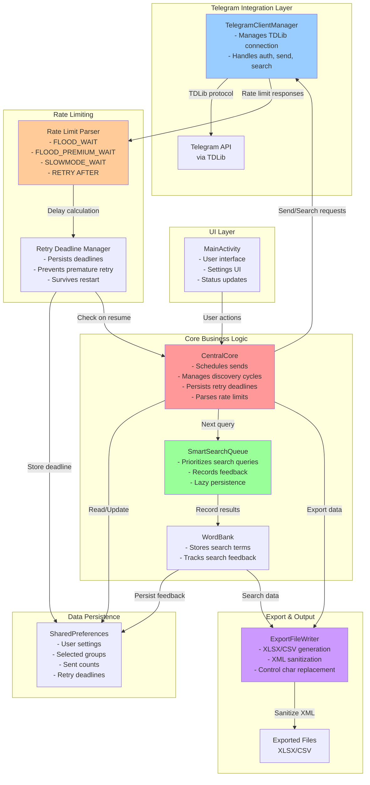
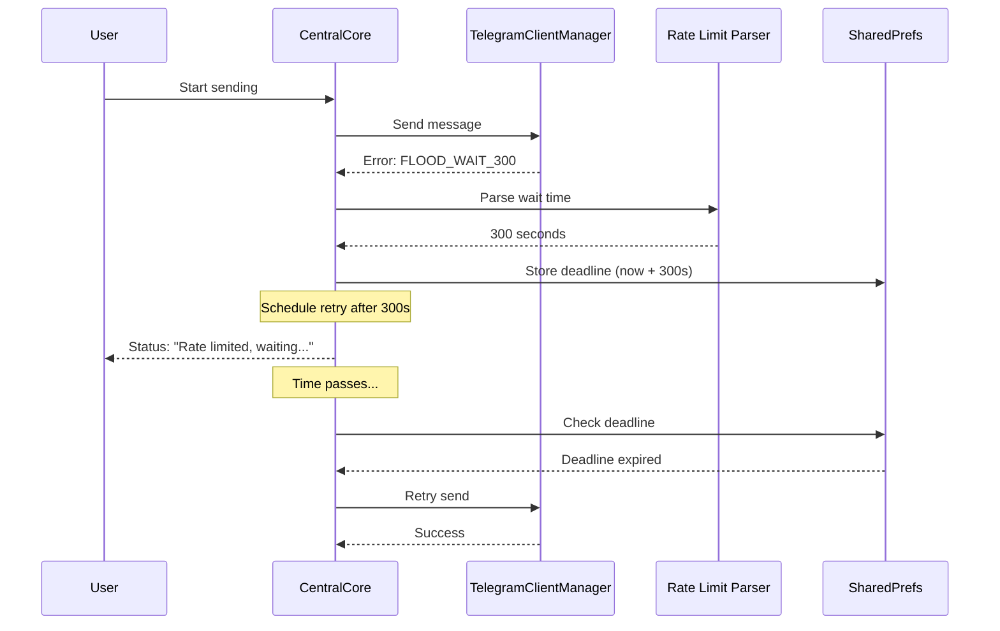
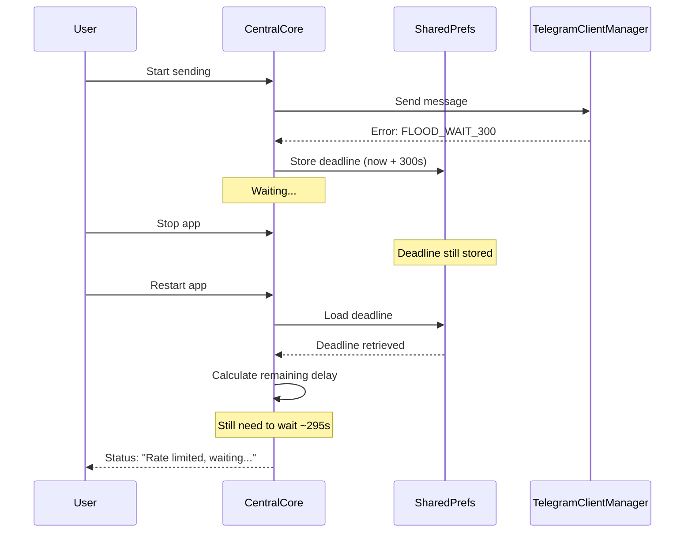

# Laleh Architecture Overview

This document provides a high-level architecture diagram of the Laleh Android application, showing the key components and their interactions.

## System Architecture

## Key Components

### 1. **CentralCore**
- Central orchestrator for send and discovery cycles
- Manages retry deadlines to respect Telegram rate limits
- Persists `retryNotBefore` timestamp across app restarts
- Handles multiple rate limit formats

### 2. **TelegramClientManager**
- Wraps TDLib (Telegram Database Library)
- Manages authentication and connection state
- Sends messages and performs searches
- Version string updated to match app version

### 3. **SmartSearchQueue**
- Intelligently prioritizes search queries
- Records search results and feedback
- **Optimization**: Only persists state after `recordResult()`, not on every `nextQuery()`
- Reduces redundant JSON writes during search cycles

### 4. **ExportFileWriter**
- Generates XLSX and CSV exports
- **New**: Replaces XML-forbidden control characters with U+FFFD
- Preserves valid Unicode (Persian text, emoji, supplementary chars)
- Ensures exported files remain valid and readable

### 5. **Rate Limit Parser**
- Recognizes multiple Telegram wait formats:
  - `FLOOD_WAIT_[seconds]`
  - `FLOOD_PREMIUM_WAIT_[seconds]`
  - `SLOWMODE_WAIT_[seconds]`
  - `RETRY AFTER [seconds]`
- Converts to milliseconds and enforces delays
- Prevents both premature retries and failed requests

### 6. **Retry Deadline Manager**
- Persists rate limit deadlines in SharedPreferences
- Survives app stop/restart cycles
- Prevents accidental bypass of Telegram's rate limits
- Uses safe arithmetic to avoid overflow

## Data Flow: Rate-Limited Send

## Data Flow: App Restart During Rate Limit

## Version Information

- **App Version**: 1.12.1 (version code: 15)
- **Build Configuration**: Gradle Kotlin DSL
- **CI/CD**: GitHub Actions (APK builds on PR + push)

## Testing Coverage

- `CentralCoreTest`: Rate limit parsing and deadline persistence
- `ExportFileWriterTest`: XML sanitization with control characters
- `SmartSearchQueueTest`: Single serialization per search cycle

## Build & CI

- **Build System**: Gradle with Kotlin DSL
- **CI Workflow**: `.github/workflows/build-apk.yml`
  - Triggers: `pull_request` (main), `push` (main + feature branches)
  - Concurrency controls prevent duplicate runs
  - Path filters optimize workflow execution
